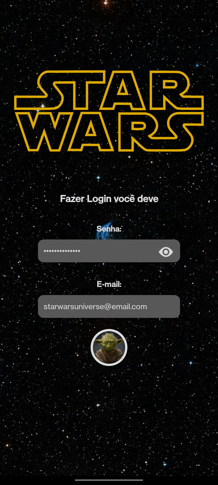
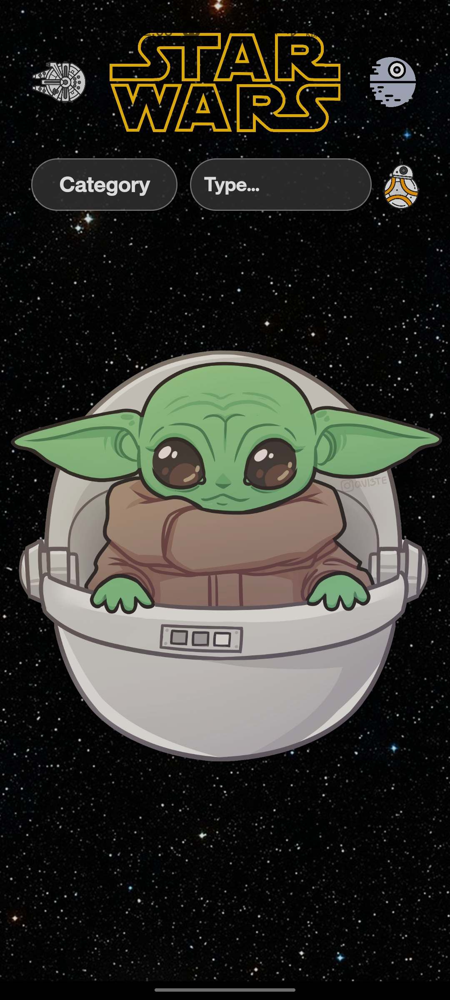
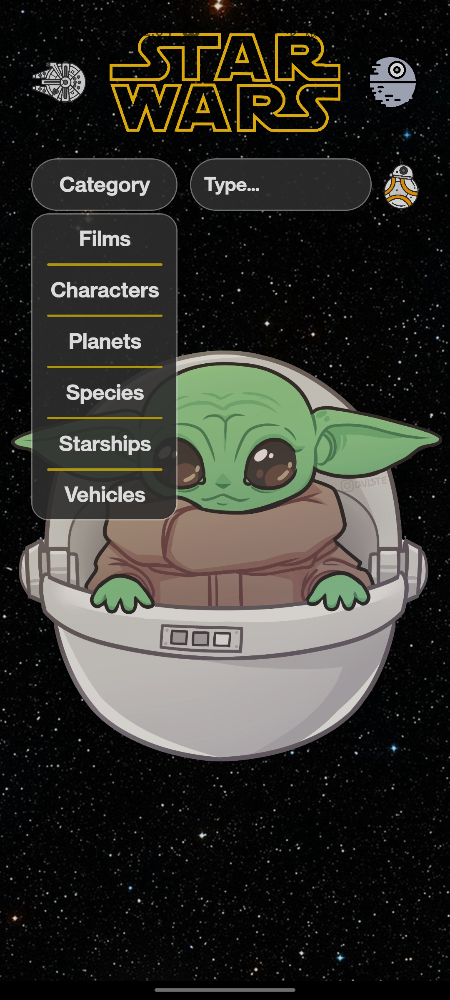
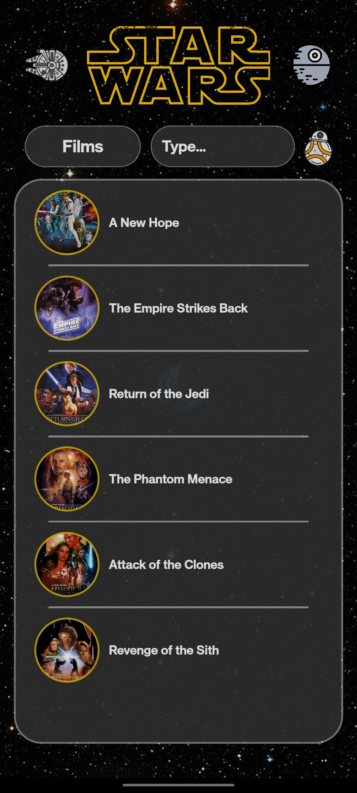
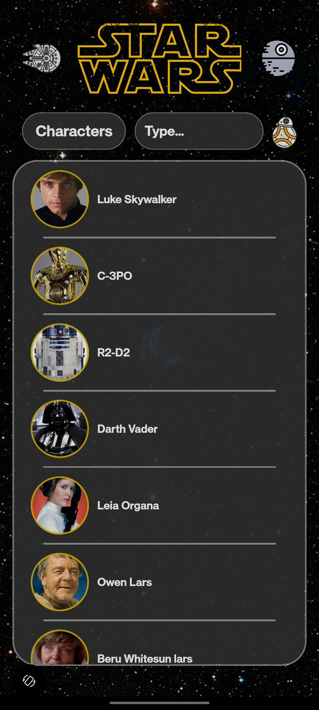
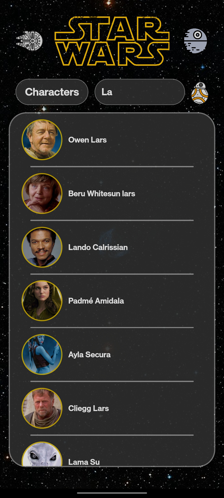
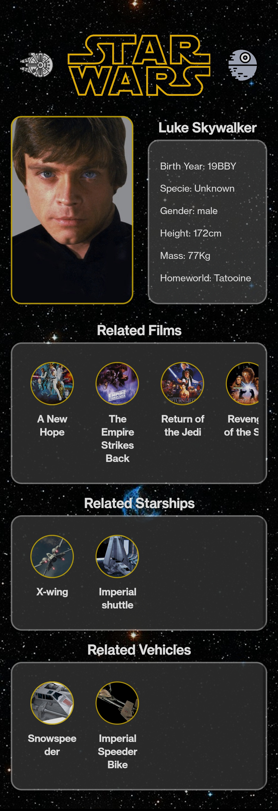
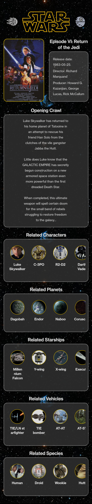

# Projeto Integrador III - Star Wars Universe

Projeto realizado durante o 3° semestre de Análise e Desenvolvimento de Sistemas com o objeto de criar uma aplicação em React Native e realizar uma integração de API.

## Descrição

Esse projeto foi concebido a partir da ideia de desenvolver um aplicativo capaz de obter as informações presentes na API oficial de [Star Wars](https://swapi.dev), atribuindo algumas funcionalidades de navegação e intereação do usuário.
Algumas dessas opções:
- Busca por categoria
- Busca por nome
- Redirecionamento para outros objetos relacionados, por exemplo, ir para um filme ou nave espacial relacionada a determinada personagem, se existir

     

 

## Getting Started

### Visualização Online

O acesso pode ser feito através de um dos links abaixo, ambos são de repositório *Snack* do site do próprio [Expo](expo.dev):

- [Repositório - Gustavo](https://snack.expo.dev/@miithersz/starwarsuniverse)
- [Repositório - Leonardo](https://snack.expo.dev/@kinodesu/starwarsuniverse)

Obs.: É importante que ao acessar a página, no canto direito da tela onde se encontra a visualização da execução do projeto, é recomendado que selecione a opção de emulação **Android** para uma experiência melhor.

### Instalação do projeto

**Instale:**

- Computador

> [Node.js](https://nodejs.org) - Preferencialmente a versão **LTS**

> [Visual Studio Code](https://code.visualstudio.com/download)

- Celular

> **Expo go** | [Android](https://play.google.com/store/apps/details?id=host.exp.exponent) | [IOS](https://apps.apple.com/br/app/expo-go/id982107779)

**Execução:**

- No computador, abra o projeto utilizando o **Visual Studio Code**
- Abra o **Terminal** utilizando o atalho `Ctrl + '`
- Digite `npm install` e aguarde as dependências serem instaladas
- Digite `npm start`

Com o código QR aparecendo no terminal

**Android:**

- Abra o aplicativo **Expo Go**
- Selecione a opção **Escanear Código QR**
- Escaneie o código no terminal
- Aproveite : )

**IOS:**

- Abra a câmera do celular
- Escaneie o código no terminal
- Selecione **Abrir com Expo Go**
- Aproveite : )

## Authors

>[Gustavo Leme](https://github.com/MiiTHeRsZ)

>[Leonardo Noboru](https://github.com/KinoDesu)

## License

[MIT Licence](https://choosealicense.com/licenses/mit/)
